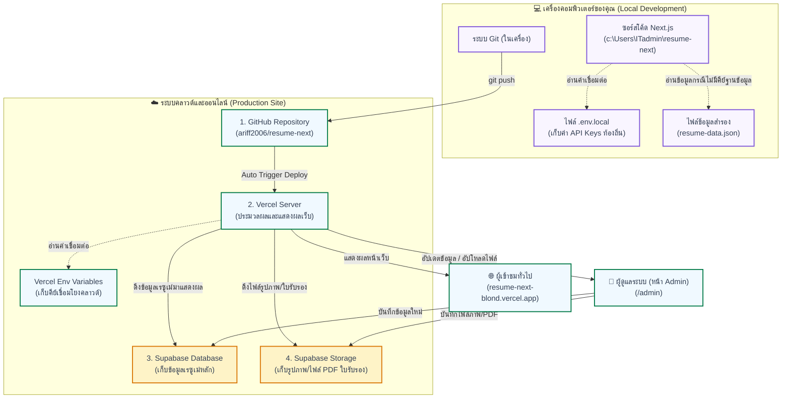

# โครงสร้างสถาปัตยกรรมและการเชื่อมต่อระบบ (Project Architecture & Connections)

เอกสารฉบับนี้อธิบายโครงสร้างการทำงานและการเชื่อมต่อของระบบเว็บไซต์เรซูเม่ออนไลน์ **`resume-next`** ว่าแต่ละส่วนทำงานและเชื่อมโยงกันอย่างไร ทั้งในส่วนของระบบพัฒนาในเครื่อง (Local) และระบบออนไลน์จริง (Cloud)

---

## 📊 แผนผังการทำงานของระบบ (System Flowchart)

---

## 🛠️ รายละเอียดการทำงานของแต่ละส่วนและการเชื่อมโยง

### 1. เครื่องคอมพิวเตอร์ของคุณ (Local Computer)
* **โฟลเดอร์งาน:** ตั้งอยู่ที่ `c:\Users\ITadmin\resume-next` ซึ่งเก็บซอร์สโค้ดทั้งหมดที่เราพัฒนา
* **ไฟล์ `src/data/resume-data.json` (Local Data):** ทำหน้าที่เป็นข้อมูลสำรอง (Fallback) หากเราเปิดทดสอบระบบบนเครื่องตัวเองโดยไม่ได้ระบุคีย์ต่อกับฐานข้อมูลระบบจะดึงไฟล์นี้มาแสดงผลแทนเพื่อให้ทำงานต่อได้ไม่สะดุด
* **ไฟล์ `.env.local`:** เป็นไฟล์ที่เก็บค่าเชื่อมต่อกับฐานข้อมูลคลาวด์ เช่น `SUPABASE_SERVICE_ROLE_KEY` เมื่อเราใส่คีย์จริงในเครื่อง ระบบส่วนพัฒนาในเครื่องจะเชื่อมต่อตรงกับฐานข้อมูลออนไลน์ทันที

### 2. คลังโค้ด GitHub (GitHub Repository)
* **หน้าที่:** เป็นแหล่งจัดเก็บโค้ดระบบความปลอดภัยสูง (Version Control) 
* **การเชื่อมโยง:** เมื่อมีการสั่ง `git push` จากคอมพิวเตอร์ของคุณ ตัวโค้ดล่าสุดจะส่งขึ้นไปยัง GitHub ทันที จากนั้น GitHub จะส่งสัญญาณไปบอก **Vercel** ให้ทำการอัปเดตหน้าเว็บจริงโดยอัตโนมัติ

### 3. ระบบโฮสติ้ง Vercel (Production Hosting)
* **หน้าที่:** เป็นตัวประมวลผลเซิร์ฟเวอร์เพื่อให้ผู้ใช้ทั่วไปเข้าถึงเว็บไซต์ผ่านลิงก์ `resume-next-blond.vercel.app`
* **การเชื่อมโยง:** ดึงการตั้งค่าคีย์ฐานข้อมูลจาก **Vercel Environment Variables** เพื่อส่งคำขอข้อมูลไปยัง **Supabase** อย่างปลอดภัยโดยไม่ต้องแสดงคีย์นั้นให้ผู้ใช้งานภายนอกเห็น

### 4. ฐานข้อมูลและจัดเก็บไฟล์ Supabase (Database & Storage)
* **Supabase Database (PostgreSQL):** เก็บข้อมูลเนื้อหาในเรซูเม่ทั้งหมด (เช่น ประวัติการทำงาน, การศึกษา, ทักษะ และข้อมูลส่วนตัว) โดยเก็บในตารางชื่อว่า `resumes`
* **Supabase Storage:** เป็นถังเก็บไฟล์สื่อออนไลน์ (Bucket) สำหรับเก็บรูปภาพหน้าคุณ หรือไฟล์รูปภาพ/PDF ของใบรับรองที่อัปโหลดผ่านหน้า Admin
